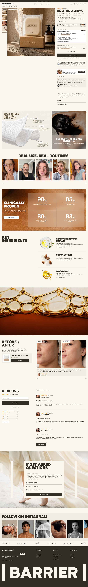
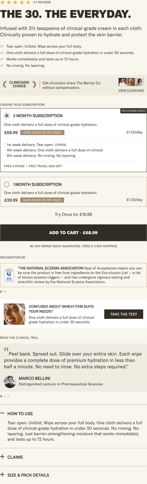
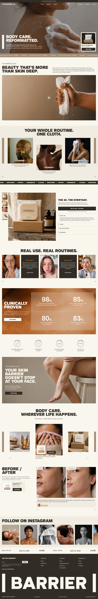

# Barrier Co Project Architecture

Internal build plan. Not for the client.

## Purpose
This is the build plan for the Barrier Co theme. Every custom block, section and snippet below is built from its entry here, and the template map is the order pages are assembled in. Developers and reviewers use it; QA ticks ✅ once an entry passes.

## Project Overview
- **Type:** new build on an existing, password-protected store that currently runs a landing-page theme ("Updated Barrier LP || 17.09", Horizon 4.1.1).
- **Base:** Horizon 4.2.0 (`f9aef27`). The theme is pushed as the unpublished "Barrier Co · release/1" (#167298138367).
- **Templates designed:** home and product, desktop (1440) and mobile (390). Every other template uses styled stock Horizon (tokens.md T-1).
- **Principle:** reuse Horizon's sections, blocks and JS components wherever the design fits, and style them through the token layer. Build custom work only where Horizon has no equivalent. That keeps JS and CSS weight down and Horizon updates mergeable.

## Store Architecture
- **Section groups:** header group (announcements, header) and footer group (social gallery, logo list, footer).
- **Data:** `docs/data-model.md` defines 13 product metafields and 7 metaobject types, all created on 2026-10-01.
- **Markets:** United States, USD.
- **Apps:** see Apps.

### Colour model (Horizon 4.2)
Horizon 4.2 has no colour schemes. Every custom section gets a `background_color` colour setting (defaulting to a palette swatch, with blank meaning the page background) and renders Horizon's `contrast-override` snippet with `section_id`. That sets `--color-foreground`, `--color-border` and the button variables for its surface. Styles read only `var(--color-*)` and the token variables. Setting values and schema defaults are the only places a hex appears.

### Shared conventions for every custom file
- **Styles:** plain CSS inside the file's ``. Only `var(--space-*)`, `var(--layout-*)`, `var(--type-*)` (or the `.type-<role>` classes), `var(--color-*)`, `var(--opacity-brand-*)`, `var(--effect-*)` and `var(--icon-*)`. No px, no hex, no `rgb()`; translucent colours use `color-mix()`. Media queries use `(min-width: 990px)` for desktop and `(min-width: 750px)` for tablet. Those are the only px allowed.
- **Section shell:** the outer element gets `color-custom-{{ section.id }}` and the section gets `"class": "section-wrapper"`. Horizontal padding is `var(--layout-gutter)`, content max width is `var(--layout-content-width)`, and vertical rhythm comes from padding settings (range, step 2, `t:` labels) with a "Same at mobile" pair.
- **JS:** reuse Horizon components (`slideshow-component`, `accordion-custom`, `marquee-component`, `comparison-slider`, `deferred-media`, `product-form`). New behaviour goes in a small module in `assets/` imported through the importmap only when Horizon has nothing. No jQuery and no libraries.
- **Images:** `image_url` with `widths` and `sizes` through Horizon's `image` snippet or `image_tag`. Only the first hero image and the first product image are `loading: eager` with `fetchpriority: high`.
- **Schema:** every string is a `t:` key. Each file adds its keys to `docs/locale-fragments/<file>.json` (`{"names": {...}, "settings": {...}, ...}`), merged into `locales/en.default.schema.json` once. Presets render real-looking content.
- **No comments** except the LiquidDoc `` on snippets and blocks.

## Template map
| Template | Sections in order |
| --- | --- |
| Header group | header-announcements (stock), header (stock, transparent over the first home section) |
| index | hero-banner · marquee (stock, press quotes) · intro-media · image-carousel ("Routine" preset) · marquee (stock, ticker) · featured-product (stock + custom blocks) · video-testimonials · clinical-results · feature-icons · hero-banner ("Inset banner" preset) · image-carousel ("Lifestyle" preset) · before-after |
| product | product-information (stock + custom blocks, sticky add to cart on) · benefit-hotspots · video-testimonials · clinical-results · ingredient-list · video-banner · before-after · reviews (stock `section` + Judge.me app block) · faq-panel |
| Footer group | social-gallery · logo-list · footer (stock: email signup, menus, text, jumbo-text "BARRIER", copyright, policies) |
| collection, cart, search, page, blog, article, 404, password | Stock Horizon, styled by tokens |

## Theme Blocks
Index:
- [breadcrumbs](#breadcrumbs)
- [product-rating](#product-rating)
- [product-highlights](#product-highlights)
- [clinician-proof](#clinician-proof)
- [purchase-options](#purchase-options)
- [recognition-slider](#recognition-slider)
- [promo-card](#promo-card)
- [quote-slider](#quote-slider)
- Stock blocks reused: text, button, image, video, group, accordion with _accordion-row, product-title, product-description, price, buy-buttons, _product-media-gallery, email-signup, menu, jumbo-text, footer-copyright, footer-policy-list, social-links

### breadcrumbs
**Status:** planned · **Starter Candidate:** yes

**Figma file:** https://www.figma.com/design/oZ00gYRP11BAdFQYwo4fxj/?node-id=977-716&m=dev · **Animation:** n/a
**Description & purpose:** a "Home | Product | Title" trail above the product.
**Requirements:** `<nav aria-label>` with an `<ol>`; the current page uses `aria-current="page"`; uses the `body_small` type role, with the trail in Tan and the current item in Clay. Desktop only by default (the design has no mobile breadcrumb), with a "Show on mobile" toggle.
**Dynamic data source:** `product`, `collection` or `page`, plus `product.collections.first` when available.
**Merchant configuration:** show on mobile (checkbox, off).
**Behaviour:** static.

### product-rating
**Status:** planned · **Starter Candidate:** yes
**Figma file:** node 965:2045 (buy box, top) · **Animation:** n/a
**Description & purpose:** stars plus "4.7 reviews" at the top of the buy box, linking to the reviews section.
**Requirements:** renders the `star-rating` snippet from `product.metafields.reviews.rating` and `rating_count`, and nothing when the count is 0. The link target is a setting (default `#reviews`).
**Dynamic data source:** `reviews.rating` and `reviews.rating_count` (written by Judge.me).
**Merchant configuration:** label format (text, default "[count] reviews"); link anchor (text).

### product-highlights
**Status:** planned · **Starter Candidate:** yes
**Figma file:** node 965:2045 · **Animation:** n/a
**Description & purpose:** a ticked list of selling points.
**Requirements:** a `<ul>` with a check icon (Horizon `icon-checkmark`), using `body_small`.
**Dynamic data source:** `product.metafields.custom.highlights`.
**Merchant configuration:** none beyond the metafield; the block is hidden when the metafield is empty.

### clinician-proof
**Status:** planned · **Starter Candidate:** no
**Figma file:** node 965:2075 · **Animation:** n/a
**Description & purpose:** a Linen strip with a "Clinicians' Choice" laurel mark, a text line, up to 3 avatar images and a "View clinicians" link.
**Requirements:** the laurel mark is an image setting (SVG from the asset pack); the text is inline_richtext; the avatars are 3 image settings at 26px (icon token).
**Merchant configuration:** mark image, text, avatar 1–3, link label, link URL, background colour.

### purchase-options
**Status:** planned · **Starter Candidate:** yes

**Figma file:** Subscription component 978:3703 (WEB 978:3702, MOB 978:3701) · **Animation:** n/a
**Description & purpose:** radio cards for each selling plan ("3 month subscription", "1 month subscription"), with a "Recommended" tag, description, price, "Save $X vs try once", the per-day price, and the plan description (delivery timeline, perks). A "Try once for $X" link selects one-time purchase.
**Requirements:**
- Native `selling_plan_groups`, so it works with any subscription app (D-2).
- A fieldset of radio inputs named `selling_plan`, inside the product form (`form="{{ product_form_id }}"`).
- When a plan changes, it dispatches the event Horizon's `product-form`/`product-price` listens to, so the add-to-cart label price updates.
- Savings are calculated from `selling_plan_allocation.compare_at_price` against `price`. The per-day price is the plan price divided by the plan's day count (from a block setting per plan position, default 90 and 30).
- With no selling plans it renders nothing, and the product falls back to one-time purchase.
- States: selected, unselected, focus-visible, disabled when the variant is unavailable.
**Dynamic data source:** `product.selling_plan_groups`, `variant.selling_plan_allocations`.
**Merchant configuration:** heading ("Choose your subscription"), recommended plan position (number 1–3), recommended label, show per-day price, show one-time link, one-time label ("Try once for [price]").

### recognition-slider
**Status:** planned · **Starter Candidate:** no
**Figma file:** node 965:2147 (PDP OP2 overlay 965:2904) · **Animation:** slide
**Description & purpose:** "Recognition by" seals with logo and text, one per slide, with dots.
**Requirements:** Horizon `slideshow-component` (no new JS); hairline Fossil border.
**Dynamic data source:** `product.metafields.custom.recognitions`.
**Merchant configuration:** heading.

### promo-card
**Status:** planned · **Starter Candidate:** yes
**Figma file:** node 965:2157 · **Animation:** n/a
**Description & purpose:** the quiz card: an image, heading and text, with a small button ("Take the test").
**Requirements:** a row on desktop, stacked on mobile (from the design); the button uses the Small size.
**Merchant configuration:** image, heading, text, button label, button link, background colour.

### quote-slider
**Status:** planned · **Starter Candidate:** yes
**Figma file:** Clinical trial component 978:3947 (WEB 978:3946, MOB 978:3945) · **Animation:** slide
**Description & purpose:** "Read the clinical trial" quotes with a quote mark, text, round avatar, name and role, with dots.
**Requirements:** Horizon `slideshow-component`; a Linen card; the avatar uses `--radius-full`.
**Dynamic data source:** `product.metafields.custom.testimonials`.
**Merchant configuration:** heading, background colour.

## Theme Components
Index:
- [hero-banner](#hero-banner)
- [intro-media](#intro-media)
- [image-carousel](#image-carousel)
- [video-testimonials](#video-testimonials)
- [clinical-results](#clinical-results)
- [feature-icons](#feature-icons)
- [before-after](#before-after)
- [benefit-hotspots](#benefit-hotspots)
- [ingredient-list](#ingredient-list)
- [video-banner](#video-banner)
- [faq-panel](#faq-panel)
- [social-gallery](#social-gallery)
- [logo-list](#logo-list)
- Stock sections reused and styled: header-announcements, header, marquee, featured-product, product-information, section (reviews wrapper), footer

### hero-banner
**Status:** planned · Preset section · Presets: "Hero" (full-bleed, product spotlight) and "Inset banner" (inset 1380 wide, eyebrow, button)

**Figma file:** Hero 965:1254 / mobile 965:3083; banner 965:1579 / mobile 965:3294
**Description & purpose:** full-bleed or inset image (or video loop) with a heading behind a vertical bar, body text, an optional button, an optional play button that opens the brand film, and an optional product spotlight card (image, title, "Starts from $X/mo", Shop now).
**Requirements:**
- `image_desktop` and `image_mobile` in one `<picture>`. The image is eager and high priority when the section is first on the page.
- Heading level setting separate from size (display or h1 roles).
- Vertical bar: `--icon-bar-desktop` / `--icon-bar-mobile`, in the foreground colour.
- The play button opens a `dialog` with a lazy video (the `video-player` snippet). Nothing loads before the click.
- The product spotlight renders the `product-spotlight` snippet: a white card, Small Shop now button, and "Starts from" taken from the lowest selling-plan price, falling back to the product price.
- Text is white on the image (contrast skipped because there's media); the gradient overlay uses `--color-overlay` at `--opacity-brand-overlay`.
**Merchant configuration:** image desktop and mobile (Same at mobile), video (optional), overlay toggle, eyebrow, heading, heading tag, heading size (display/h1), text (richtext), button label and link, show bar, play video file or URL, spotlight product, spotlight label, content position (bottom left / centre left), width (full / inset), padding top and bottom (Same at mobile).

### intro-media
**Status:** planned · Preset section
**Figma file:** 965:1329 / mobile 965:3147; editorial option 965:3065
**Description & purpose:** an eyebrow and large heading on the left with body text on the right, then a full-width video or image underneath (or two tiles, from the OP2 editorial option).
**Requirements:** a two-column header on desktop and stacked on mobile; the video uses the `video-player` snippet (poster first, plays on click).
**Merchant configuration:** eyebrow, heading, heading tag, text, media type (image or video), image, video, poster, second tile toggle, background colour, padding.

### image-carousel
**Status:** planned · Preset section · Presets: "Routine" (label overlay on image, caption under) and "Lifestyle" (subheading, product overlay on the middle card)
**Figma file:** routine 965:1339 / mobile 965:3157; lifestyle 965:1587 / mobile 965:3302
**Description & purpose:** a heading, then 3 or more cards with images. The middle card is taller or offset on desktop, with Tan side bars at the edges. Arrows on desktop, one card plus dots on mobile.
**Requirements:** Horizon `slideshow-component` for mobile paging and arrows. Card label with the bars ("I CLEANSE I") uses `card_label`. An optional product overlay on a card renders `product-spotlight` (glass variant: blur `--layout-blur-card`).
**Blocks (section-local):** `card` with image, label, caption, optional product.
**Merchant configuration:** heading, subheading, background colour (Routine defaults to Linen), show side bars, offset middle card, padding.

### video-testimonials
**Status:** planned · Preset section
**Figma file:** home 965:1433 / mobile 965:3223; PDP 965:2235 / mobile 965:3649
**Description & purpose:** "Real use. Real routines." A horizontal row of portrait UGC video cards (play on click), optionally mixed with Clay quote cards (stars, quote, name). Arrows on desktop, dots on mobile.
**Requirements:** videos come from `ugc_video` metaobjects. The source is either the section's `metaobject_list` setting or the product metafield `custom.ugc_videos` on the PDP (a "Use product videos" toggle). Quote cards are blocks referencing a `testimonial` metaobject or typed in. Videos are `preload="none"` with a poster, and one plays at a time.
**Blocks (section-local):** `video` (metaobject or file), `quote` (testimonial metaobject or text fields).
**Merchant configuration:** heading, source toggle, video list, background colour, padding.

### clinical-results
**Status:** planned · Preset section
**Figma file:** STATS component 978:4053 (WEB 978:4052, MOB 978:4051)
**Description & purpose:** "Clinically proven": a background image, heading, text and a white button on the left, with a 2×2 glass grid of stats (big number, unit, caption) on the right. Stacked on mobile.
**Requirements:**
- Stats come from `clinical_result` metaobjects: the section's `metaobject_list` setting, or the product's `custom.clinical_results` when on the PDP.
- Glass: `color-mix(--color-glass, opacity-brand-glass)` + `backdrop-filter: blur(var(--layout-blur-glass))`, borders white at `--opacity-brand-glass-border`.
- Numbers use the `stat` and `stat_unit` type roles.
**Merchant configuration:** image desktop and mobile, heading, text, button label and link, source toggle, results list, inset width toggle, padding.

### feature-icons
**Status:** planned · Preset section
**Figma file:** 965:1502 / mobile 965:3293
**Description & purpose:** four round "100% proven" badge icons with two-line captions. A row on desktop (max width 1150, centred) and a 2×2 grid on mobile.
**Blocks (section-local):** `item` with icon image (SVG) and caption.
**Merchant configuration:** columns on desktop (range 2–6), background colour, padding.

### before-after
**Status:** planned · Preset section
**Figma file:** home 965:1614 / mobile 965:3328; PDP 965:2350 / mobile 965:3769
**Description & purpose:** heading, text and a product mini card on the left. On the right, a pair of before and after images with labels and a testimonial card underneath, paged with arrows (dots on mobile).
**Requirements:** slides are `before_after` metaobjects (section setting or product `custom.before_afters`); `slideshow-component`; the labels are white chips using `label`; the mini card uses the `product-spotlight` snippet (row variant).
**Merchant configuration:** heading, text, product, source toggle, comparisons list, background colour, padding.

### benefit-hotspots
**Status:** planned · Preset section
**Figma file:** PDP 965:2198 / mobile 965:3615
**Description & purpose:** on the left, a Linen panel with a heading and a product image with dotted callout lines to labels and text (Cleanse, Hydrate, Protect). On the right, a photo with a glass panel ("One cloth. Three key benefits.") and dots.
**Requirements:** callouts are blocks with x/y position (range %), label and text; lines are CSS borders. On mobile the panels stack and the callouts become a list under the image. The right panel's glass card uses `slideshow-component` for multiple messages.
**Blocks (section-local):** `callout` (x, y, label, text), `message` (heading, text).
**Merchant configuration:** heading, product image, photo, background colour, padding.

### ingredient-list
**Status:** planned · Preset section
**Figma file:** 965:2290 / mobile 965:3712
**Description & purpose:** "Key ingredients" heading on the left; rows on the right with an ingredient image, name and ticked benefits, separated by Fossil hairlines.
**Requirements:** reads from `product.metafields.custom.ingredients`, or a section `metaobject_list` off the PDP. Ingredient images are transparent PNGs with the shadow baked in (T-23).
**Merchant configuration:** heading, source toggle, list, background colour, padding.

### video-banner
**Status:** planned · Preset section
**Figma file:** 965:2346 / mobile 965:3766
**Description & purpose:** a full-bleed video poster with a play button that plays inline.
**Requirements:** the `video-player` snippet; poster image desktop and mobile; aspect ratio 1440:776 on desktop and 1:1 on mobile.
**Merchant configuration:** video (file or URL), poster desktop and mobile, aspect ratio (range), padding.

### faq-panel
**Status:** planned · Preset section
**Figma file:** FAQs component 978:4244 (WEB 978:4243, MOB 978:4242)
**Description & purpose:** a background image with a Sandstone panel (Tan side bars on desktop) holding "Most asked questions", an accordion and a "Read more FAQ" button.
**Requirements:** Horizon `accordion-custom` with `
`; items from `faq_item` metaobjects (section setting, or the product's `custom.faq_items` on the PDP); outputs FAQPage JSON-LD when on the PDP; the first item open by default (setting).
**Merchant configuration:** image desktop and mobile, heading, source toggle, items, open first, button label and link, padding.

### social-gallery
**Status:** planned · Preset section (footer group)
**Figma file:** Insta component 978:4341 (WEB 978:4340, MOB 978:4339)
**Description & purpose:** "Follow on Instagram" heading, then a horizontally scrolling row of square tiles (about 6 on desktop, 2.3 on mobile) on Linen, with an Instagram icon on one tile.
**Requirements:** CSS scroll-snap, no JS; images lazy-loaded; each tile links out (`rel="noopener"`, opens in a new tab); D-4 manual images.
**Blocks (section-local):** `tile` with image and link.
**Merchant configuration:** heading, profile link, background colour, padding.

### logo-list
**Status:** planned · Preset section (footer group)
**Figma file:** home 965:1652 (logo bar), mobile 965:3381
**Description & purpose:** a row of partner or stockist logos (Equinox, Delta One, Credo). Spaced out on desktop; Horizon `marquee-component` scrolls them on mobile.
**Blocks (section-local):** `logo` with image, alt and link.
**Merchant configuration:** logo height (range), scroll on mobile, background colour, padding.

## Theme Snippets
Index:
- [video-player](#video-player)
- [product-spotlight](#product-spotlight)
- [star-rating](#star-rating)
- [carousel-controls](#carousel-controls)
- [design-tokens](#design-tokens) ✅
- [brand-fonts](#brand-fonts) ✅

### video-player
Poster image plus a round frosted play button (Alpha/Light/20 with blur). Clicking swaps in a `<video>` (Shopify-hosted, `preload="none"`) or a YouTube/Vimeo iframe through Horizon's `deferred-media`. Params: video, video_url, poster, poster_mobile, sizes, play_size (`small`/`large`), loop, autoplay_muted.

### product-spotlight
A product card in three variants: `card` (hero, white, image above text), `row` (before/after mini card, image left) and `glass` (carousel overlay). It shows the title, a "Starts from [price]/mo" line (the lowest selling-plan price, or the product price) and a Shop now button (Small). Params: product, variant, label.

### star-rating
Five stars in `--color-rating`, with a partial star by clip, and a visually hidden "Rated X out of 5". Params: rating, size.

### carousel-controls
Previous/next arrow buttons (Horizon `icon-arrow`) and dots for `slideshow-component`, styled to the design: thin arrows at the edges, dots in Tan at `--opacity-brand-inactive`. Params: slide_count, style (`arrows`, `dots`, `both`).

### design-tokens ✅
Generated by `scripts/build_token_css.py` from `docs/tokens.json`.

### brand-fonts ✅
Self-hosted brand faces and Horizon font variable overrides. See tokens.md Fonts.

## Stock sections: styling plan
| Section | Change | How |
| --- | --- | --- |
| header-announcements | Clay bar, announcement type, thin chevrons, 37/30 side padding | Settings + `snippets/brand-overrides.liquid` stylesheet |
| header | Logo left, menu centred (nav type, uppercase), utilities as text links framed by bars ("| SEARCH |"); transparent with white text over the home hero; Clay on Sandstone elsewhere | Settings (transparent on home) + brand-overrides |
| marquee | Tan press-quote strip; Clay ticker with `title_bold` uppercase separated by bars | Settings + brand-overrides |
| featured-product, product-information | Gallery thumbnails in a left rail, square edges, buy box width 482, type roles, sticky bar styling | Settings + brand-overrides |
| footer | Clay background, email signup with an underline input and SUBMIT, three menus, tagline, "| BARRIER |" jumbo-text with bars, legal row | Settings + brand-overrides |
| Buttons (global) | Square, uppercase, `button` type role; hover/pressed/disabled by opacity; focus ring from `--effect-focus-ring` | brand-overrides |

`snippets/brand-overrides.liquid` holds targeted overrides of stock Horizon classes, scoped as tightly as possible, so stock files stay untouched and Horizon updates merge cleanly.

## Apps
| App | Purpose | Theme touchpoints | Performance cost | Owner |
| --- | --- | --- | --- | --- |
| Judge.me | Reviews and Q&A, star ratings | App embed; review widget app block in the PDP reviews section; writes `reviews.rating` | Judge.me script on the PDP; check its lazy-load setting | Client |
| Google & YouTube (mm-google-shopping) | Merchant Center feed | Variant metafields only | None on the storefront | Client |
| Subscription app (D-2, not chosen) | Selling plans | `purchase-options` block reads native selling plans; the app's own embed if it needs one | Depends on the app | Client |
